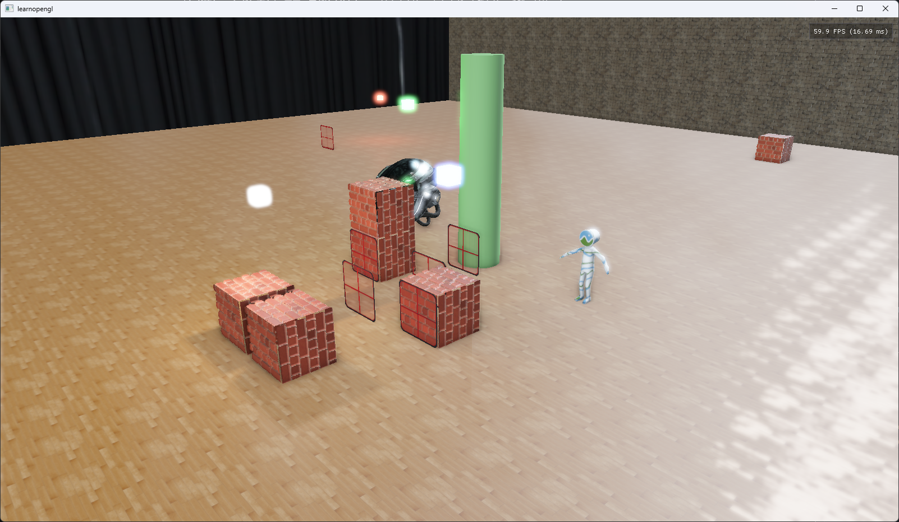

# glfwdojo

[](https://github.com/KDKyota/glfwdojo/actions/workflows/ci.yml)

リポジトリ名は気にしないでください．これは元々Publicにする予定ではなかったので，雑に命名したのでこうなっています．

[LearnOpenGL](https://learnopengl.com/) の内容を、モダンな C++（C++17）で一から実装し直しながら OpenGL とリアルタイムグラフィックスを学ぶための個人学習リポジトリです。

<table>
<tr>
<td></td>
<table>
</tr>
</table>
<tr>
<td></td>
<td></td>
<td></td>
</tr>
</table>

---

## このプロジェクトについて

LearnOpenGL のサンプルコードをそのまま写経するのではなく、以下を意識して書き直しています。

- **チュートリアルの `main.cpp` 一枚岩を、責務ごとのクラスに分割する** — `Scene` / `Shader` / `Camera` / `Model` / `Mesh` / `TextureCache` など
- **RAII とスマートポインタでリソースを管理する** — 生の `new` / `delete` を使わない。VAO / VBO / テクスチャ / FBO / RBO といった GL オブジェクトも `src/gl/GlHandle.h` のハンドル型に包み、`glDelete*` を手で並べない
- **章をまたいだ機能を1つのシーンに統合する** — 各章を独立したサンプルにせず、シャドウ・法線マッピング・HDR・Bloom・Deferred Shading が同時に動く1つのシーンとして積み上げる

GL ハンドルは CRTP（Curiously Recurring Template Pattern）で実装しています。「デストラクタから型ごとの `glDelete*` を呼ぶ」という要求が `virtual` では満たせない（基底のデストラクタからは派生の仮想関数に届かない）ためで、副産物としてオブジェクトサイズが生の `unsigned int` から増えず、`create()` が `glGen*` 1個へインライン化されます。詳細は [`docs/DEVELOPMENT.md`](./docs/DEVELOPMENT.md) の「GL リソースの持ち方」を参照してください。

そのため、章が進むごとに既存コードのリファクタリングが発生します。**動くコードを完成させること自体ではなく、なぜその設計になるのかを理解することを目的**にしています。

実装中に踏んだ落とし穴やデバッグの過程は [`docs/DEVELOPMENT.md`](./docs/DEVELOPMENT.md) にまとめています。

---

## 実装済みの機能

| 分類           | 機能                                                                        |
| -------------- | --------------------------------------------------------------------------- |
| 基礎           | カメラ操作、深度テスト、ステンシルテスト、ブレンディング、フェイスカリング  |
| ライティング   | **PBR（Cook-Torrance / GGX）**、点光源 / 平行光源 / スポットライト          |
| 環境ライティング | **IBL** — HDR 環境マップから irradiance / prefilter / BRDF LUT を事前計算 |
| モデル         | Assimp による OBJ / **glTF (`.glb`)** 読み込み、ノード階層の保持、埋め込みテクスチャ、glTF の PBR マテリアル、テクスチャキャッシュ（`weak_ptr` 管理）、**スキニングとアニメーション** |
| テクスチャ     | キューブマップ（スカイボックス）、法線マッピング、視差遮蔽マッピング（POM） |
| キャラクター   | 三人称追従カメラ（クォータニオン）、`WASD` によるカメラ基準の移動、円柱形状による衝突判定・押し出し |
| 高度な機能     | フレームバッファ、インスタンシング、UBO によるユニフォーム共有              |
| 影             | ポイントシャドウ（キューブマップ + 26方向サンプリングの PCF）               |
| 環境光遮蔽     | SSAO（半球カーネル + 4x4 ノイズ回転 + ブラー）                              |
| 透過表現       | 半透明ガラス（前方描画 + 透過色の乗算ブレンド）、**色の付いた透過シャドウ** |
| 色管理         | sRGB テクスチャによるリニアワークフロー、ガンマ補正                         |
| ポストプロセス | HDR + 露出トーンマッピング、Bloom（Compute Shader + 共有メモリによるガウシアンブラー） |
| デバッグ UI    | Dear ImGui によるパラメータ調整と G-Buffer / SSAO の可視化                  |
| **描画方式**   | **Deferred Shading（G-Buffer + ライトボリュームによる打ち切り）**           |
| 単位系         | ワールド座標 **1.0 = 1 メートル**（`src/core/SceneUnits.h` に寸法の定数を集約） |
| CI             | GitHub Actions で Debug / Release のビルドとシェーダー登録漏れを検証        |

### 今後の予定

PBR + IBL は実装済みです。現在は **キャラクターをボーンで動かし、階段を含む地形の上を歩かせる** ことを目標に進めています。

- モデル描画経路の PBR 復帰（ノード階層の保持・glTF マテリアル・ボーン属性の受け皿） — 完了
- スキニングとアニメーション — 完了
- 三人称追従カメラ（クォータニオン） — 完了
- キャラクターの移動（三人称カメラの `W` / `A` / `S` / `D`）と衝突判定 — 完了
- 階段を含む地形と接地

そのほか、平面反射 / SSR、環境マップからの平行光源シャドウ、Vulkan への移行とレイトレーシングを積んでいます。

**やることリストは [GitHub Issues](https://github.com/KDKyota/glfwdojo/issues) に集約しています。**
上のロードマップはマイルストーン [「キャラクターを動かす」](https://github.com/KDKyota/glfwdojo/milestone/1) にまとめてあります。
Issue には `opengl-now`（OpenGL のまま着手できる）と `needs-vulkan`（Vulkan 移行が前提）のラベルを付けているので、
どちらの作業かはラベルで区別できます。

---

## レンダリングパイプライン

起動時に一度だけ、HDR 環境マップから IBL 用の irradiance / prefilter / BRDF LUT を焼きます。
以降、1フレームは以下の順で処理されます。

```
[0] 透過窓の準備         カメラからの距離でソートし、インスタンス VBO を更新
[1] シャドウデプスパス   点光源4灯 × 6面のデプスキューブマップを生成
     + カラーサブパス    同じ FBO にガラスの透過色を焼き込む（色の付いた影）
[2] 行列 UBO の更新      view / projection を全シェーダーで共有する
[3] Geometry パス        G-Buffer に 位置 / 法線+メタリック / アルベド+ラフネス を書き込む
[4] SSAO パス            G-Buffer から遮蔽率を計算し、4x4 ブラーをかける
[5] 深度のコピー         G-Buffer の深度を前方描画用のフレームバッファへ blit
[6] Lighting パス        フルスクリーンクワッド1枚で全ピクセルの PBR + IBL を計算
[7] 前方描画             ライトキューブ / スカイボックス / 半透明のガラス
[8] Bloom                輝度抽出結果を Compute Shader でブラー
[9] 合成                 トーンマッピング + ガンマ補正して画面へ
```

パス同士は FBO とテクスチャで繋がっているため、順序に意味があります（例: SSAO は G-Buffer が埋まっていないと計算できない）。各パスの設計意図と注意点は [`docs/DEVELOPMENT.md`](./docs/DEVELOPMENT.md) の「描画の流れ」を参照してください。

---

## 技術スタック

- **言語** — C++17
- **ビルド** — CMake（`CMakePresets.json`）+ Ninja
- **パッケージ管理** — vcpkg（manifest mode / `vcpkg.json`）
- **依存ライブラリ** — GLFW3, GLM, GLAD, Assimp, Dear ImGui

---

## 動作環境

### 必要なもの

| 項目           | 要件                                                                               |
| -------------- | ---------------------------------------------------------------------------------- |
| GPU / ドライバ | **OpenGL 4.6 コアプロファイル**（`src/app/Window.cpp` でコンテキストを要求しています） |
| コンパイラ     | C++17 対応（Windows: MSVC / Linux: GCC・Clang）                                    |
| ビルドツール   | CMake 3.20 以上 + Ninja                                                            |
| パッケージ管理 | vcpkg（manifest mode。環境変数 `VCPKG_ROOT` の設定が必要）                         |

依存ライブラリ（GLFW3 / GLM / GLAD / Assimp / Dear ImGui）は vcpkg が `vcpkg.json` を見て自動で解決するので、個別のインストールは不要です。

### 動作確認した環境

1台のノート PC 上で、Windows 側と WSL2 側の両方でビルド・実行しています。

|                    | Windows                                           | Linux (WSL2)                           |
| ------------------ | ------------------------------------------------- | -------------------------------------- |
| OS                 | Windows 11 (build 26200)                          | Ubuntu 24.04 LTS on WSL2 (kernel 6.18) |
| コンパイラ         | MSVC 19.51（Visual Studio 18.x Community）        | GCC 13.3                               |
| CMake / Ninja      | Visual Studio 同梱版                              | CMake 3.28 / Ninja 1.11                |
| CPU / GPU          | AMD Ryzen 7 7735HS + 内蔵 Radeon Graphics（iGPU） | 同じ iGPU を `d3d12` 経由で使用        |
| 使用するプリセット | `default` / `release`                             | `linux-debug`                          |

**専用 GPU は使っていません。** iGPU で 4灯のポイントシャドウ + Deferred Shading + SSAO + Bloom が30FPS動く程度の負荷です。

### WSL2 で動かす場合の注意

WSL2 はデフォルトだとソフトウェアレンダリング（llvmpipe）にフォールバックして極端に遅くなります。GPU を使うには環境変数の指定が必要です。

```bash
GALLIUM_DRIVER=d3d12 ./glfwdojo
```

環境によっては `GALLIUM_DRIVER` に別の値が必要だったり、他の環境変数を用意する必要があります。以下が参考になります。

- [Arch Wiki — OpenGL](https://wiki.archlinux.jp/index.php/OpenGL)
- [Qiita — WSL2 で OpenGL を動かす](https://qiita.com/HD_mount_Music/items/701559d57787a2f183c9)

WSL2 固有の問題（Mesa のシェーダーコンパイラが弾く書き方、d3d12 ドライバが segfault するケースなど）は [`docs/DEVELOPMENT.md`](./docs/DEVELOPMENT.md) の「Linux (WSL2) で動かす」にまとめてあります。

> **macOS は非対応です。** そもそも動作確認できていません（Macが高すぎて買えなかったので）が、仮に持っていても動きません。macOS の OpenGL は 4.1 で打ち止め（かつ 10.14 以降は deprecated）なので、本プロジェクトが要求する 4.6 コアプロファイルは原理的に取得できないためです。（OpenGL自体が古いから仕方ない）

---

## ビルドと実行

vcpkg が必要です。`VCPKG_ROOT` に vcpkg のパスを設定しておいてください。

```bash
# Windows
cmake --preset default
cmake --build --preset default
cd build/Debug && ./glfwdojo

# Linux (WSL2)
cmake --preset linux-debug
cmake --build --preset linux-debug
cd build/linux-debug && GALLIUM_DRIVER=d3d12 ./glfwdojo // 環境によっては異なる可能性があります
```

`run` プリセットを使えば、ビルドから作業ディレクトリを合わせた起動までを一度に実行できます。

```bash
cmake --build --preset run          # Debug でビルドして起動
cmake --build --preset release-run  # Release でビルドして起動
```

シェーダーと `resources/` は実行ファイルと同じディレクトリに相対パスで読み込まれるため、**手動で起動するときはビルドディレクトリに移動してから起動してください。**（`run` プリセットは `WORKING_DIRECTORY` を合わせてあるので不要です）

ファイル追加時の CMake の設定方法など、詳しい手順は [`docs/DEVELOPMENT.md`](./docs/DEVELOPMENT.md) にあります。

---

## 操作方法

起動直後は**ゲームプレイ**モードで、カーソルはウィンドウに捕捉されます。`Esc` で**ポーズ**モードに入るとカーソルが解放され、デバッグパネルを操作できます。ウィンドウがフォーカスを失ったときも自動でポーズに入ります。

| 入力           | ゲームプレイ                                    | ポーズ         |
| -------------- | ----------------------------------------------- | -------------- |
| マウス移動     | 視点の回転（ボタン不要）                        | UI の操作      |
| マウスホイール | ズーム（三人称では注視点までの距離）            | UI のスクロール |
| `W` / `S`      | 自由視点: 前進 / 後退，三人称: キャラクターの前進 / 後退（カメラ基準） | —              |
| `A` / `D`      | 自由視点: 左 / 右へ移動，三人称: キャラクターの左 / 右へ移動（カメラ基準） | —              |
| `Q` / `E`      | 下降 / 上昇（自由視点のみ）                     | —              |
| `F`            | 自由視点 / 三人称追従カメラの切り替え           | —              |
| `↑` / `↓`      | 視差遮蔽マッピングの深さ（`heightScale`）を調整 | —              |
| `Esc`          | ポーズへ                                        | ゲームプレイへ |

終了は `Paused` ウィンドウの `Exit` ボタン、またはウィンドウの閉じるボタンです。

カメラには**自由視点**と**三人称追従**の2モードがあり、`F` で切り替えます。三人称ではキャラクター（`CesiumMan`）を注視点として周回します。軌道角（ヨー・ピッチ・距離）を状態として持ち、そこから位置と向きを同時に決めるため、視点を動かしてもキャラクターは画面中心から動きません。指数補間がかかるのは注視点だけで、これがキャラクター移動時の追従ラグになります。追従先のモデルが読み込まれていない場合は切り替わりません。

三人称モードでは `W` / `A` / `S` / `D` でキャラクターがカメラの向きを基準に移動し、周囲のオブジェクトとの衝突判定（円柱形状での押し出し）が効きます。壁に斜めに当たっても向きは入力方向のまま保たれ、押し出しの副作用として壁沿いに滑ります。

### デバッグパネル（Dear ImGui）

`Esc` でポーズに入ると `Debug` ウィンドウが出ます。**再ビルドなしで**描画の中身を切り替えられるので、このプロジェクトで一番触って面白い部分です。

| 項目            | 内容                                                                                                                                                         |
| --------------- | ------------------------------------------------------------------------------------------------------------------------------------------------------------ |
| `Camera: ...`   | 現在のカメラモード（`Free look` / `Third person`）を表示。`F` キーの案内を兼ねる                                                                            |
| `View`          | 表示するものを 14 種から選ぶ。通常のライティング / シャドウ / `shadowMap` の生値 / G-Buffer の Albedo・Normal・Position・Metallic・Roughness / 4分割表示 / SSAO / 透過シャドウの色 / IBL の irradiance・prefilter・BRDF LUT |
| `Raw output`    | Bloom・トーンマッピング・ガンマ補正を飛ばす。**G-Buffer や SSAO を見るときは必須**（切らないと正常な値でも一律に真っ白く見えて判定できない）                 |
| `Show collision shape` | キャラクターの衝突判定に使っている円柱形状を可視化する                                                                                              |
| `SSAO strength` | 環境光遮蔽の効き具合                                                                                                                                         |
| `Ambient`       | 環境光の強さ                                                                                                                                                 |
| `Bloom`         | Bloom の合成量                                                                                                                                               |
| `Exposure`      | トーンマッピングの露出                                                                                                                                       |
| `Metallic` / `Roughness` | オブジェクトごとの PBR パラメータ。**roughness の下限は 0.05**（0 にすると GGX の分布が発散して真っ白な点が出る）                                   |

UI とカメラでマウスを奪い合わないよう、入力の宛先はモードで分けています。ゲームプレイ中はパネルを組み立てないので、ImGui が入力を掴むことはありません。

---

## ディレクトリ構成

```
glfwdojo/
├── .github/       GitHub Actions のワークフロー（CI / リリース）
├── src/           C++ ソース（render/Scene が描画処理の中心）
│   ├── app/       ウィンドウ・入力・ImGui
│   ├── gl/        GL リソースの薄いラッパ（ハンドル・シェーダー・テクスチャ）
│   ├── debug/     GPU 時間計測とデバッグ出力
│   ├── render/    描画パイプライン（Scene・マテリアル・ライト）
│   ├── asset/     読み込んだモデルとメッシュ
│   ├── scene/     シーン上の存在（カメラ・キャラクター・衝突）
│   └── core/      アロケータと単位系
├── shader_src/    GLSL シェーダー（ビルド後に実行ファイルの隣へコピーされる）
│                  common / shadow / gbuffer / ssao / lighting / forward / post / ibl / debug
├── bench/         計測用の単体ベンチマーク
├── resources/     テクスチャ・3Dモデル
│   ├── textures/            テクスチャと HDR 環境マップ
│   ├── publishable-objects/ 再配布できる 3D モデル
│   ├── characters/          リグ付きモデル
│   └── objects/             LearnOpenGL 由来（.gitignore 済み）
├── docs/          ドキュメント
├── third_party/   外部ライブラリ（stb_image など）
├── CMakeLists.txt
├── CMakePresets.json
└── vcpkg.json
```

`src/` はディレクトリ名を include に含めます（例: `#include "render/Scene.h"`）。`src/` 自体が include ルートです。

シェーダーは `shader_src/` で編集しますが、実行時は `add_custom_command` でコピーされたビルドディレクトリ側が読み込まれます。**新しいシェーダーを追加したときは `CMakeLists.txt` の `SHADER_SOURCES` への追記も必要**です。

シェーダーはレンダーパス単位でディレクトリを分けていますが、**コピー時は実行ファイルの隣へフラットに展開されます**。そのためコード側の指定は `Shader("skybox.vert", "skybox.frag")` のようにファイル名のみで、ディレクトリをまたいだ**同名ファイルは上書き事故になります**（CI で検出）。

---

## ドキュメント

| ファイル                                             | 内容                                                                                            |
| ---------------------------------------------------- | ----------------------------------------------------------------------------------------------- |
| [`docs/DEVELOPMENT.md`](./docs/DEVELOPMENT.md)       | 実装ガイド。冒頭に**症状から原因を引く索引**あり。設計意図、作業手順、踏んだ罠、ビルド・ファイル追加時の CMake 設定、WSL2 固有の問題 |
| [`docs/shadow_mapping.md`](./docs/shadow_mapping.md) | シャドウマッピングの学習メモ                                                                    |
| [`CLAUDE.md`](./CLAUDE.md)                           | Claude Code に作業させる際のルール                                                              |

未実装項目とやることリストは [GitHub Issues](https://github.com/KDKyota/glfwdojo/issues) にあります。ドキュメント側には TODO を置きません（二重管理になって必ずどちらかが古くなるため）。

---

## 3D モデルについて

**再配布できるモデルだけをリポジトリに含めています。**

| 置き場所                         | モデル                               | 用途                                                                                   |
| -------------------------------- | ------------------------------------ | -------------------------------------------------------------------------------------- |
| `resources/publishable-objects/` | `DamagedHelmet.glb`                  | PBR の検証用。正解の見た目が広く出回っているので実装の答え合わせに使える               |
| `resources/publishable-objects/` | `DragonDispersion.glb`               | 透過・体積減衰・分散を実装するためのモデル（未対応）                                   |
| `resources/characters/`          | `RiggedSimple.glb` / `CesiumMan.glb` | スキニングの踏み台。Khronos の glTF-Sample-Assets 由来で **CC-BY-4.0**（`*-LICENSE.md` を同梱） |

### 同梱モデルの出典とライセンス

`resources/publishable-objects/` の 2 つは、どちらも Khronos の [glTF-Sample-Assets](https://github.com/KhronosGroup/glTF-Sample-Assets) から取得したものです。ライセンス全文は各モデルの隣に `*-LICENSE.md` として同梱しています。

| モデル                 | 出典                                                                                                                                                                                                                                          | 著作者・作業内容                                                                                                                                             | ライセンス                                                                                                                                                    |
| ---------------------- | --------------------------------------------------------------------------------------------------------------------------------------------------------------------------------------------------------------------------------------------- | ------------------------------------------------------------------------------------------------------------------------------------------------------------ | ------------------------------------------------------------------------------------------------------------------------------------------------------------- |
| `DamagedHelmet.glb`    | [Damaged Helmet（Sketchfab）](https://sketchfab.com/3d-models/damaged-helmet-a1de6f1e738d446da3d50a3eebffe883)<br>[glTF-Sample-Assets/Models/DamagedHelmet](https://github.com/KhronosGroup/glTF-Sample-Assets/tree/main/Models/DamagedHelmet)   | ctxwing（2018年・glTF への再構築と変換）<br>theblueturtle\_（2016年・元モデル）                                                                                | **CC-BY-4.0**（ctxwing の作業分）<br>**CC-BY-NC-4.0**（theblueturtle\_ の元モデル分）<br>→ [DamagedHelmet-LICENSE.md](resources/publishable-objects/DamagedHelmet-LICENSE.md) |
| `DragonDispersion.glb` | [glTF-Sample-Assets/Models/DragonDispersion](https://github.com/KhronosGroup/glTF-Sample-Assets/tree/main/Models/DragonDispersion)                                                                                                              | Stanford University Computer Graphics Laboratory（1996年・ドラゴンの原型）<br>Morgan McGuire's Computer Graphics Archive（2017年・変換と整形）<br>Adobe（2021年・布の背景） | [Stanford Graphics Library](resources/publishable-objects/LicenseRef-Stanford-Graphics.txt)（ドラゴン）<br>**CC0-1.0**（布の背景）<br>→ [DragonDispersion-LICENSE.md](resources/publishable-objects/DragonDispersion-LICENSE.md) |

> [!IMPORTANT]
> どちらのモデルにも **非商用限定の条件が含まれます**。`DamagedHelmet.glb` は元モデル（theblueturtle\_）が CC-BY-NC-4.0 で、`DragonDispersion.glb` のドラゴンは Stanford Graphics Library の条件（"such models or images are not to be used for commercial purposes"）に従います。学習・研究目的での利用と無償の再配布は認められていますが、商用利用はできません。

### 同梱していないモデル

一方、LearnOpenGL で使われている 3D モデル（backpack / cyborg / nanosuit / planet / rock）は、いずれも再配布が許諾されていない、あるいはライセンスが不明なため **同梱していません**（`resources/objects/` ごと `.gitignore` 済みです）。

| モデル     | 出典                                                                                                                                                     | ライセンス表記                         |
| ---------- | -------------------------------------------------------------------------------------------------------------------------------------------------------- | -------------------------------------- |
| `backpack` | Berk Gedik（[Sketchfab](https://sketchfab.com/3d-models/survival-guitar-backpack-low-poly-799f8c4511f84fab8c3f12887f7e6b36)） / Joey de Vries により改変 | 出典表記のみ。ライセンス条項の記載なし |
| `cyborg`   | 3dregenerator（tf3dm.com） / Joey de Vries により改変                                                                                                    | **"For Personal Use Only."** と明記    |
| `planet`   | Gerhald3D（[TurboSquid](https://www.turbosquid.com/3d-models/realistic-mars-photorealistic-2k-3d-1277433)） / Joey de Vries により改変                   | 出典表記のみ。ライセンス条項の記載なし |
| `nanosuit` | Crysis（Crytek）由来                                                                                                                                     | 記載なし                               |
| `rock`     | 不明                                                                                                                                                     | 記載なし                               |

### モデルを追加したい場合

シーンに置くモデルは `src/render/Scene.h` の `modelSpawns_` にパスと配置をまとめてあります。ここへ1行足すだけで読み込まれます。

**ファイルが見つからないモデルは、コンソールに `Skipped model:` と出して読み飛ばします。** ライセンス上コミットできないモデルを各自の環境にだけ置けるようにするための仕様なので、リポジトリに無いパスが並んでいても起動します。

LearnOpenGL のモデルを使いたい場合は、[公式リポジトリ](https://github.com/JoeyDeVries/LearnOpenGL) の `resources/objects/` から取得して同名のディレクトリに配置してください。取得したモデルの利用は、各配布元のライセンスに従ってください。

> [!NOTE]
> テクスチャ（`resources/textures/`）にも LearnOpenGL 由来のものが含まれます。こちらは
> [LearnOpenGL のリポジトリ](https://github.com/JoeyDeVries/LearnOpenGL) の配布条件に準じます。

---

## 参考

- [LearnOpenGL](https://learnopengl.com/) — Joey de Vries
- 本リポジトリは上記チュートリアルを元にした学習用の再実装です
