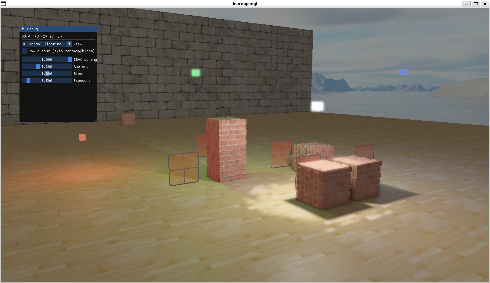
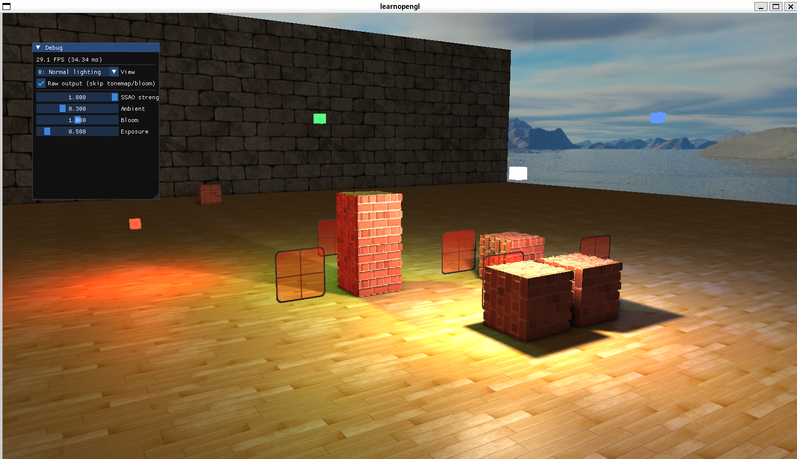
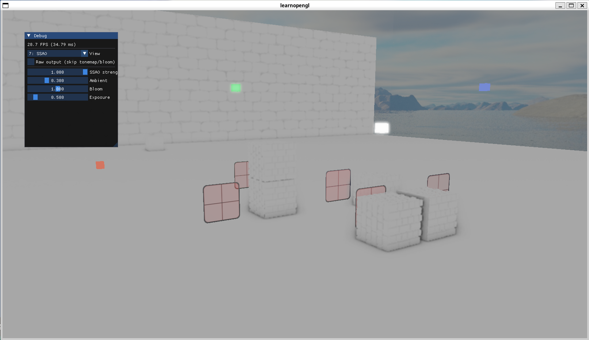

# glfwdojo

[LearnOpenGL](https://learnopengl.com/) の内容を、モダンな C++（C++17）で一から実装し直しながら OpenGL とリアルタイムグラフィックスを学ぶための個人学習リポジトリです。

<!-- ▼▼▼ ここにスクリーンショットを挿入 ▼▼▼ -->

<table>
<tr>
<td></td>
<td></td>
<td></td>
</tr>
</table>

<!-- ▲▲▲ ここにスクリーンショットを挿入 ▲▲▲ -->

---

## このプロジェクトについて

LearnOpenGL のサンプルコードをそのまま写経するのではなく、以下を意識して書き直しています。

- **チュートリアルの `main.cpp` 一枚岩を、責務ごとのクラスに分割する** — `Scene` / `Shader` / `Camera` / `Model` / `Mesh` / `TextureCache` など
- **RAII とスマートポインタでリソースを管理する** — 生の `new` / `delete` を使わない
- **章をまたいだ機能を1つのシーンに統合する** — 各章を独立したサンプルにせず、シャドウ・法線マッピング・HDR・Bloom・Deferred Shading が同時に動く1つのシーンとして積み上げる

そのため、章が進むごとに既存コードのリファクタリングが発生します。**動くコードを完成させること自体ではなく、なぜその設計になるのかを理解することを目的**にしています。

実装中に踏んだ落とし穴やデバッグの過程は [`docs/DEVELOPMENT.md`](./docs/DEVELOPMENT.md) にまとめています。

---

## 実装済みの機能

| 分類           | 機能                                                                        |
| -------------- | --------------------------------------------------------------------------- |
| 基礎           | カメラ操作、深度テスト、ステンシルテスト、ブレンディング、フェイスカリング  |
| ライティング   | Phong 反射モデル、点光源 / 平行光源 / スポットライト                        |
| モデル         | Assimp による OBJ 読み込み、テクスチャキャッシュ（`weak_ptr` 管理）         |
| テクスチャ     | キューブマップ（スカイボックス）、法線マッピング、視差遮蔽マッピング（POM） |
| 高度な機能     | フレームバッファ、インスタンシング、UBO によるユニフォーム共有              |
| 影             | ポイントシャドウ（キューブマップ + 26方向サンプリングの PCF）               |
| ポストプロセス | HDR + 露出トーンマッピング、Bloom（2パス ガウシアンブラー）                 |
| **描画方式**   | **Deferred Shading（G-Buffer + ライトボリュームによる打ち切り）**           |

### 今後の予定

- [x] SSAO（Screen Space Ambient Occlusion）
- [ ] PBR（物理ベースレンダリング）
- [ ] ライトボリュームのジオメトリ描画による最適化
- [ ] G-Buffer の帯域削減（深度からの位置復元、法線の圧縮）

---

## レンダリングパイプライン

1フレームは以下の順で処理されます。

```
[1] シャドウデプスパス   点光源4灯 × 6面のデプスキューブマップを生成
[2] Geometry パス        G-Buffer に 位置 / 法線 / アルベド+スペキュラ を書き込む
[3] 深度のコピー         G-Buffer の深度を後続パス用のフレームバッファへ blit
[4] Lighting パス        フルスクリーンクワッド1枚で全ピクセルのライティングを計算
[5] 前方描画             ライトキューブ / スカイボックス / 半透明の窓
[6] Bloom                輝度抽出結果をピンポン FBO で10回ブラー
[7] 合成                 トーンマッピング + ガンマ補正して画面へ
```

各パスの設計意図と注意点は [`docs/DEVELOPMENT.md`](./docs/DEVELOPMENT.md) を参照してください。

---

## 技術スタック

- **言語** — C++17
- **ビルド** — CMake（`CMakePresets.json`）+ Ninja
- **パッケージ管理** — vcpkg（manifest mode / `vcpkg.json`）
- **依存ライブラリ** — GLFW3, GLM, GLAD, Assimp

---

## 動作環境

OpenGL **4.6 コアプロファイル**が必要です。

> **実行環境**: Windows laptop, RyzenのCPU，iGPUとWSL2のUbuntu

Windows と Linux（WSL2）の両方でビルド・実行できます。WSL2 で GPU を使う場合は `GALLIUM_DRIVER=d3d12` のオプション指定が必要です（詳細は [`docs/DEVELOPMENT.md`](./docs/DEVELOPMENT.md) の「Linux (WSL2) で動かす」を参照）。

> 環境次第では`GaLLIUM_DRIVER`の値が違ったり，別の環境変数を用意する必要があるかもしれないです．以下のサイトを参考にして見てください

[Arch Wiki](https://wiki.archlinux.jp/index.php/OpenGL)

[Qiita](https://qiita.com/HD_mount_Music/items/701559d57787a2f183c9)

> Macでの動作はテストしていません。なぜかというとMacが高すぎて買えなかったから

---

## ビルドと実行

vcpkg が必要です。`VCPKG_ROOT` に vcpkg のパスを設定しておいてください。

```bash
# Windows
cmake --preset default
cmake --build --preset default
cd build/Debug && ./glfwdojo

# Linux (WSL2)
cmake --preset linux-debug
cmake --build --preset linux-debug
cd build/linux-debug && GALLIUM_DRIVER=d3d12 ./glfwdojo // 環境によっては異なる可能性があります
```

シェーダーと `resources/` は実行ファイルと同じディレクトリに相対パスで読み込まれるため、**実行時はビルドディレクトリに移動してから起動してください。**

ファイル追加時の CMake の設定方法など、詳しい手順は [`docs/BUILD.md`](./docs/BUILD.md) にあります。

---

## 操作方法

| 入力           | 動作                                            |
| -------------- | ----------------------------------------------- |
| `W` / `S`      | 前進 / 後退                                     |
| `A` / `D`      | 左 / 右へ移動                                   |
| `Q` / `E`      | 下降 / 上昇                                     |
| 右ドラッグ     | 視点の回転                                      |
| マウスホイール | ズーム（FOV の変更）                            |
| `↑` / `↓`      | 視差遮蔽マッピングの深さ（`heightScale`）を調整 |
| `Esc`          | 終了                                            |

---

## ディレクトリ構成

```
glfwdojo/
├── src/           C++ ソース（Scene が描画処理の中心）
├── shader_src/    GLSL シェーダー（ビルド後に実行ファイルの隣へコピーされる）
├── resources/     テクスチャ・3Dモデル
├── docs/          ドキュメント
├── third_party/   外部ライブラリ（stb_image など）
├── CMakeLists.txt
├── CMakePresets.json
└── vcpkg.json
```

シェーダーは `shader_src/` で編集しますが、実行時は `add_custom_command` でコピーされたビルドディレクトリ側が読み込まれます。**新しいシェーダーを追加したときは `CMakeLists.txt` の `SHADER_SOURCES` への追記も必要**です。

---

## ドキュメント

| ファイル                                             | 内容                                                                                          |
| ---------------------------------------------------- | --------------------------------------------------------------------------------------------- |
| [`docs/DEVELOPMENT.md`](./docs/DEVELOPMENT.md)       | 実装ガイド。パスの設計意図、よくある落とし穴、画面が壊れたときのデバッグ手法、WSL2 固有の問題 |
| [`docs/BUILD.md`](./docs/BUILD.md)                   | ビルド手順、ファイル追加時の CMake 設定                                                       |
| [`docs/shadow_mapping.md`](./docs/shadow_mapping.md) | シャドウマッピングの学習メモ                                                                  |
| [`CLAUDE.md`](./CLAUDE.md)                           | Claude Code に作業させる際のルール                                                            |

---

## 3D モデルについて

**Assimp による 3D モデルの読み込み・描画機能は実装済みですが、このリポジトリにモデルデータは同梱していません。**

LearnOpenGL で使われている 3D モデル（backpack / cyborg / nanosuit / planet / rock）は、いずれも再配布が許諾されていない、あるいはライセンスが不明なものです。

| モデル     | 出典                                                                                                                                                     | ライセンス表記                         |
| ---------- | -------------------------------------------------------------------------------------------------------------------------------------------------------- | -------------------------------------- |
| `backpack` | Berk Gedik（[Sketchfab](https://sketchfab.com/3d-models/survival-guitar-backpack-low-poly-799f8c4511f84fab8c3f12887f7e6b36)） / Joey de Vries により改変 | 出典表記のみ。ライセンス条項の記載なし |
| `cyborg`   | 3dregenerator（tf3dm.com） / Joey de Vries により改変                                                                                                    | **"For Personal Use Only."** と明記    |
| `planet`   | Gerhald3D（[TurboSquid](https://www.turbosquid.com/3d-models/realistic-mars-photorealistic-2k-3d-1277433)） / Joey de Vries により改変                   | 出典表記のみ。ライセンス条項の記載なし |
| `nanosuit` | Crysis（Crytek）由来                                                                                                                                     | 記載なし                               |
| `rock`     | 不明                                                                                                                                                     | 記載なし                               |

そのため、**モデル描画のコードは意図的にコメントアウトしてあります**（`src/Scene.cpp` の `Model` 生成箇所）。現在のシーンはプリミティブ（キューブ・平面）とテクスチャのみで構成されています。

### モデルを表示したい場合

1. [LearnOpenGL の公式リポジトリ](https://github.com/JoeyDeVries/LearnOpenGL) の `resources/objects/` からモデルを取得する
2. 本リポジトリの `resources/objects/` に配置する（このディレクトリは `.gitignore` 済みです）
3. `src/Scene.cpp` の `Model` 生成箇所と、`Render()` 内の描画呼び出しのコメントアウトを解除する

取得したモデルの利用は、各配布元のライセンスに従ってください。

> [!NOTE]
> テクスチャ（`resources/textures/`）にも LearnOpenGL 由来のものが含まれます。こちらは
> [LearnOpenGL のリポジトリ](https://github.com/JoeyDeVries/LearnOpenGL) の配布条件に準じます。

---

## 参考

- [LearnOpenGL](https://learnopengl.com/) — Joey de Vries
- 本リポジトリは上記チュートリアルを元にした学習用の再実装です
