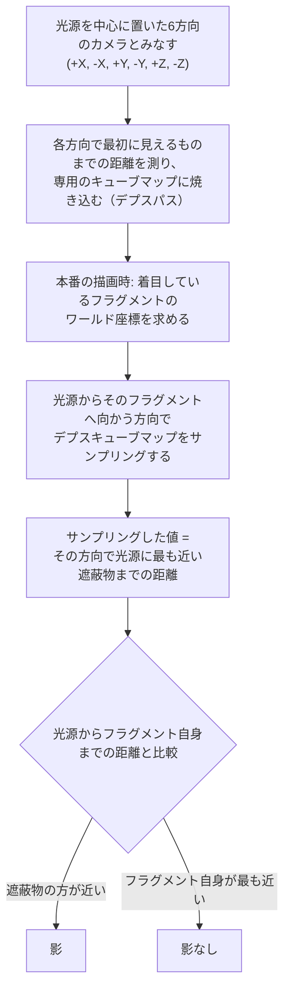
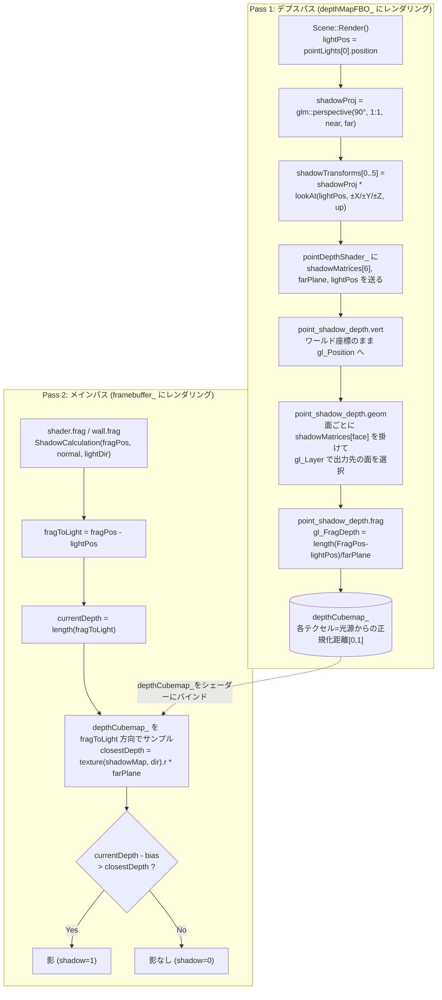
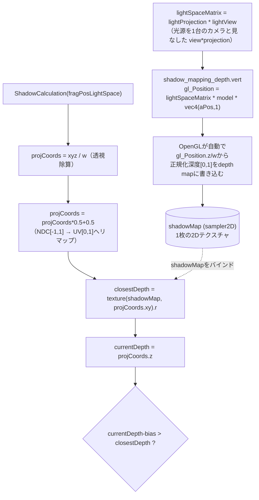

# シャドウマッピング 変数リファレンス & 計算フロー

このドキュメントは、シャドウ生成に関わる主要な変数の役割・計算方法・使われ方を整理したものです。
現在このリポジトリで **実際にレンダリングに使われているのは Point Shadow（キューブマップ版）** です。
`shadow_mapping_depth.vert` / `shadow_mapping_depth.frag`（ディレクショナルライト用の2D shadow map版）は
`Scene.cpp` からは呼び出されておらず、比較用の参考実装として残っています。

---

## 1. Point Shadow Mapping（現在使用中）

### 1.1 アルゴリズムの考え方（概念）

点光源は全方向を照らすため、光源を「6方向（±X, ±Y, ±Z）を向いた1台のカメラ」とみなすと理解しやすくなります。
この段階では、まだこのリポジトリの変数名やファイル名は出てきません。一般的な考え方だけを追ってください。



**押さえておきたいポイント:**

- キューブマップの1テクセルには「色」ではなく「光源からの距離」が入っている（スカイボックスと同じキューブマップという入れ物を、中身だけ距離情報にして使い回しているイメージ）
- 6方向ぶんまとめて1枚のキューブマップに焼き込むので、本番描画側は「今見ているフラグメントの方向」でサンプリングするだけで済む（どの面かを自分で判定する必要がない）
- 判定自体は「距離の比較」という単純なロジック（ただし境界付近の誤差対策として `bias` などの補正が必要になる。詳細は 1.3 の表を参照）

### 1.2 自分のプログラムでの実装フロー

上記の考え方を、このリポジトリでは以下のように2パス構成で実装しています。
ここから先は、このリポジトリの変数名・ファイル名がそのまま登場します。1.1 のどのステップに対応しているかを意識しながら読んでください。



> 1.1 の B（デプスパス）が Pass 1 の A〜H、1.1 の C〜F（本番描画の判定）が Pass 2 の I〜O に対応しています。

### 1.3 変数リファレンス

#### C++側 (`Scene.h` / `Scene.cpp`)

| 変数 | 宣言場所 | 役割 |
|---|---|---|
| `SHADOW_WIDTH`, `SHADOW_HEIGHT` | `Scene.h` | `depthCubemap_` の各面の解像度（1024×1024）。大きいほど影の輪郭が精細になるが、GPU負荷とメモリが増える |
| `shadowNearPlane_` | `Scene.h` | 光源視点の透視投影の near plane |
| `shadowFarPlane_` | `Scene.h` | 光源視点の透視投影の far plane。**シェーダー側 `farPlane` uniform と必ず同じ値にする必要がある**（正規化・逆正規化の基準が食い違うと影が壊れる） |
| `depthMapFBO_` | `Scene.h` | 深度専用フレームバッファ。カラーバッファは持たず `depthCubemap_` のみをアタッチ |
| `depthCubemap_` | `Scene.h` | 6面ぶんの `GL_DEPTH_COMPONENT` キューブマップ。各テクセルには「光源からの正規化距離」が入る（色ではない） |
| `lightPos`（`Render()`内） | `Scene.cpp` | シャドウを落とす点光源のワールド座標。6方向すべての `lookAt` の視点原点になる |
| `shadowProj`（`Render()`内） | `Scene.cpp` | 立方体の1面をちょうど覆う画角90°の透視投影行列。6面で共通利用 |
| `shadowTransforms`（`Render()`内） | `Scene.cpp` | `shadowProj * lookAt(...)` を+X,-X,+Y,-Y,+Z,-Zの6方向ぶん計算した `view*projection` 行列の配列。`point_shadow_depth.geom` の `shadowMatrices[6]` にそのまま渡される |

#### シェーダー側（デプスパス）

| 変数                  | 宣言場所                                | 役割                                                                                                |
| ------------------- | ----------------------------------- | ------------------------------------------------------------------------------------------------- |
| `shadowMatrices[6]` | `point_shadow_depth.geom`           | C++側の `shadowTransforms` を受け取る uniform 配列                                                         |
| `gl_Layer`          | `point_shadow_depth.geom`           | 出力先を `depthCubemap_` の6面のうちどれにするか選ぶビルトイン変数                                                        |
| `FragPos`（out/in）   | `point_shadow_depth.geom` → `.frag` | ラスタライズされるフラグメントのワールド座標（透視除算前）。frag側で光源との距離計算に使う                                                   |
| `lightPos`          | `point_shadow_depth.frag`           | 光源のワールド座標                                                                                         |
| `farPlane`          | `point_shadow_depth.frag`           | 距離を `[0,1]` に正規化するための除数                                                                           |
| `gl_FragDepth`      | `point_shadow_depth.frag`           | 書き込み先。`length(FragPos - lightPos) / farPlane`（**投影のz値ではなく実距離**を使うのがポイント。面の継ぎ目で深度が不連続にならないようにするため） |

#### シェーダー側（メインパス `ShadowCalculation`, `shader.frag` / `wall.frag`）

| 変数 | 役割 |
|---|---|
| `shadowMap`（`samplerCube`） | `depthCubemap_` がバインドされる。UV座標ではなく**方向ベクトル**でサンプリングする点が2D版との最大の違い |
| `farPlane` | `shadowMap` から読んだ正規化距離を実距離スケールに戻すための係数 |
| `fragToLight` | `fragPos - lightPos`。正規化せずそのまま `samplerCube` のサンプリング方向として使う |
| `currentDepth` | `length(fragToLight)`。光源から現在のフラグメントまでの実距離 |
| `bias` | 法線とライト方向のなす角に応じて可変にするスロープバイアス。shadow acne（縞模様のノイズ）対策 |
| `closestDepth` | `fragToLight` 方向にある「光源から見た最も近い遮蔽物までの距離」。`shadowMap` から読んだ値に `farPlane` を掛けて実距離に戻したもの |
| `sampleOffsetDirections[26]` | `{-1,0,1}^3` から中心`(0,0,0)`を除いた26方向（立方体の頂点8+辺の中点12+面の中心6）。PCF（ソフトシャドウ）のために `fragToLight` を少しずつ散らす。サンプル数を増やすほど `shadow` が取り得る段階数（現在27段階: 0/26〜26/26）が増え、影の縁のグラデーションが細かくなる |
| `offset` | `sampleOffsetDirections` に掛ける係数。2D版の `texelSize` に相当する役割だが、UV空間ではなく方向ベクトル空間のオフセット量なので固定値になっている |

---

## 2. 複数ポイントライトへの拡張

現在このリポジトリでは、上記の Point Shadow の仕組みを **4つの点光源すべてに対して並行して持たせています**。
「新しいアルゴリズム」ではなく「1灯ぶんの仕組みを配列にして4回繰り返しているだけ」という位置づけで読んでください。

### 2.1 概念は変わらない

1.1 で説明したアルゴリズム（6方向のカメラとみなす → 距離をキューブマップに焼く → サンプリングして比較する）自体は、1灯でも4灯でも同じです。
変わるのは「1灯ぶんのデプス用キューブマップ + そのデプスパス」を、光源の数だけ並べて持つようになった、という点だけです。

### 2.2 スカラー → 配列になった箇所

| 1灯版（1.2の図） | 現在（4灯版） |
|---|---|
| `depthMapFBO_` | `depthMapFBO_[4]` |
| `depthCubemap_` | `depthCubemap_[4]` |
| `samplerCube shadowMap` | `samplerCube shadowMap[4]`（`shader.frag`/`wall.frag` は `NR_POINT_LIGHTS` で定義） |
| `shadowTransforms`（フレームの最初に1回だけ計算） | 光源ごとのループの中で毎回計算し直す（保持しない使い捨て） |

### 2.3 インデックス `j` が全レイヤーを貫通する

複数光源対応でもっとも事故が起きやすいのがここです。C++・GPUのテクスチャユニット・シェーダーの3層すべてで、**同じ添字 `j` を使って対応関係を保つ**必要があります。

| レイヤー | 対応する要素 |
|---|---|
| C++: 光源データ | `pointLights_[j]`（`Scene.h`） |
| C++: デプスパスの出力先 | `depthMapFBO_[j]` → `depthCubemap_[j]` |
| C++→シェーダー: バインド先のテクスチャユニット | `glActiveTexture(GL_TEXTURE3 + j)` |
| シェーダー: サンプラー | `shadowMap[j]`（`samplerCube shadowMap[4]` の `j` 番目） |
| シェーダー: 光源データ | `pointLights[j]`（`applyPointLights()` からC++側で送る uniform 配列） |

どこか1箇所でも `j` がズレると、「光源Aの影が光源Bの位置に出る」といった、見た目だけでは原因を特定しづらい不具合につながります。デバッグする際はまずこの対応表を疑ってください。

### 2.4 二重ループになったデプスパス

`Scene::Render()` のデプスパスは、疑似コードで書くと次のような二重ループになっています。

```
for j in 0..3:                     // ★光源ごとのループ（4灯対応で新規に増えた部分）
    lightPos = pointLights_[j].position
    shadowTransforms = 6方向ぶんの view*projection 行列を計算   // 1.1・1.2 で説明した処理そのもの
    depthMapFBO_[j] をバインドしてクリア
    renderFloor() / renderCubes() を pointDepthShader_ で描画
        → 内部では point_shadow_depth.geom が 1 draw call で
          gl_Layer を使い6面すべてに振り分ける（変更なし）
```

外側の `for j in 0..3` が今回追加されたループで、内側の「6面ぶんの処理」は 1.2 で説明した仕組みがそのまま使われています。

> **パフォーマンスへの注意:** 光源が1つ増えるごとに、デプスパスでシーン全体を丸ごと再描画するコストが1回分増えます。4灯構成では、本番描画とは別に1フレームあたり4回ぶんのシーン再描画がデプスパスだけで走っている、ということになります。光源数を増やす際はこのコストが線形に増える点を意識してください。

### 2.5 テクスチャユニットの割り当て

本番パス（`shader.frag` / `wall.frag` / `cube.frag`）でバインドされているテクスチャユニットの一覧です。新しくテクスチャを追加する際は、ユニット7以降を使ってください。

| ユニット | 内容 | 設定箇所 |
|---|---|---|
| 0 | diffuse / 通常テクスチャ | `setInt("diffuseMap", 0)` など |
| 1 | normal map | `setInt("normalMap", 1)` |
| 2 | height map（Parallax Mapping用） | `setInt("heightMap", 2)` |
| 3〜6 | `shadowMap[0]`〜`shadowMap[3]`（4灯ぶんの `depthCubemap_`） | `setInt("shadowMap[" + i + "]", 3 + i)` |

### 2.6 落とし穴

- **ユニット番号のオフセットを忘れる**: `glActiveTexture(GL_TEXTURE3 + j)` の `3 +` を忘れて `GL_TEXTURE0 + j` としてしまうと、diffuse/normal/heightMap 用のユニットとシャドウマップが衝突する。
- **光源数を変更するときの変更漏れ**: `shader.frag` / `wall.frag` は `#define NR_POINT_LIGHTS 4` を1箇所変えるだけで済むが、`cube.frag` は `uniform samplerCube shadowMap[4];` のように数値が直書きされている。光源数を変える場合は3ファイルすべてを確認すること。また `Scene.h` 側の `pointLights_` 配列のサイズ・`depthMapFBO_[4]` / `depthCubemap_[4]` の確保数（`glGenFramebuffers(4, ...)` 等）もあわせて変更が必要。
- **`j` のループ変数名の衝突**: デプスパスのループでは光源のインデックスに `j`、6面ぶんのループに `i` を使うなど、既存コードの命名（`Render()` 内）に合わせて使い分けると、後から読んだときに「どちらのループの添字か」が分かりやすい。

---

## 3. （参考・未使用）Directional Shadow Mapping — 2D shadow map版

`shadow_mapping_depth.vert/.frag` は、ディレクショナルライトのような「1方向だけを照らす光源」用の実装です。
現在の `Scene.cpp` では呼び出されていませんが、Point Shadow との違いを理解するための比較対象として整理します。

### 3.1 計算フロー



### 3.2 Point Shadow 版との対応比較

| 観点 | Directional（2D shadow map） | Point Shadow（cubemap） |
|---|---|---|
| テクスチャ種別 | `sampler2D` 1枚 | `samplerCube` 6面 |
| 光源視点変換 | `lightSpaceMatrix`（CPU側で1つだけ計算） | `shadowMatrices[6]`（6方向ぶん計算し、geometry shaderで1回のdraw callで全面に描画） |
| サンプリング座標 | `projCoords.xy`（透視除算＋`*0.5+0.5`のリマップが必要） | `fragToLight`（方向ベクトルをそのまま渡すだけ） |
| 深度の保存形式 | 投影されたNDCのz（`gl_Position.z/w`、OpenGLが自動書き込み） | 光源からの実距離を`farPlane`で正規化した線形値（`gl_FragDepth`に明示的に書き込み） |
| PCFのオフセット | `texelSize = 1.0/textureSize(shadowMap,0)` でUV空間を1テクセル分ずらす | `sampleOffsetDirections[20] * offset` で3D方向ベクトル自体を散らす |
| フラスタム外の扱い | `if(projCoords.z > 1.0) shadow = 0.0;` で明示的にガード | 全方向をcubemapでカバーしているため同種のガードは基本的に不要 |

### 3.3 `textureSize` / `texelSize` について

- `textureSize(sampler, lod)`: 指定したmipmapレベルにおけるテクスチャの実解像度を返すGLSL組み込み関数。CPU側からuniformで解像度を渡さなくても、シェーダー自身が参照中のテクスチャサイズを取得できる。
- `texelSize = 1.0 / textureSize(shadowMap, 0)`: UV空間（`[0,1]`）で「1テクセル分だけ動くのに必要なオフセット量」。PCFのループで `projCoords.xy + vec2(x,y) * texelSize` とすることで、シャドウマップの解像度によらず常に隣接テクセルの中心を正しくサンプリングできる。
- Point Shadow版では方向ベクトルをサンプリングに使うため、この「UV空間でのテクセルサイズ」という概念がそのままでは使えず、固定値 `offset = 0.05` で代用している（`samplerCube` に対しても `textureSize` は呼び出せるが、現在の実装では使われていない）。

---

## 4. 用語ミニ解説

- **shadow acne**: `bias` が小さすぎるときに、影を落とす面自身に縞模様のノイズが出る現象。深度値の丸め誤差が原因。
- **PCF (Percentage Closer Filtering)**: 影判定を1点だけでなく周辺複数点で行い、結果を平均することで影の輪郭をぼかす手法。
- **shadow acneとpeter panningのトレードオフ**: `bias` を大きくしすぎると、今度は物体が地面から浮いて見える「peter panning」が起きる。`bias` の値は両者のバランスを見て調整する。
